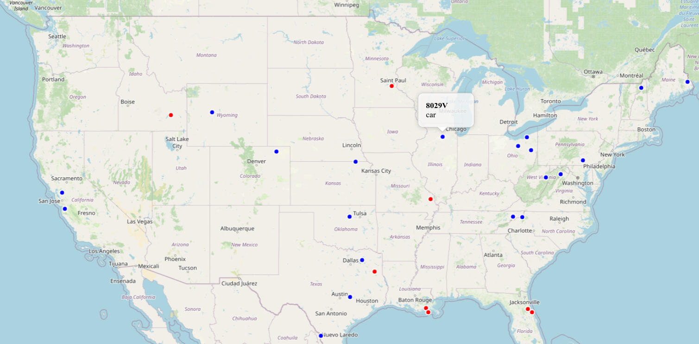
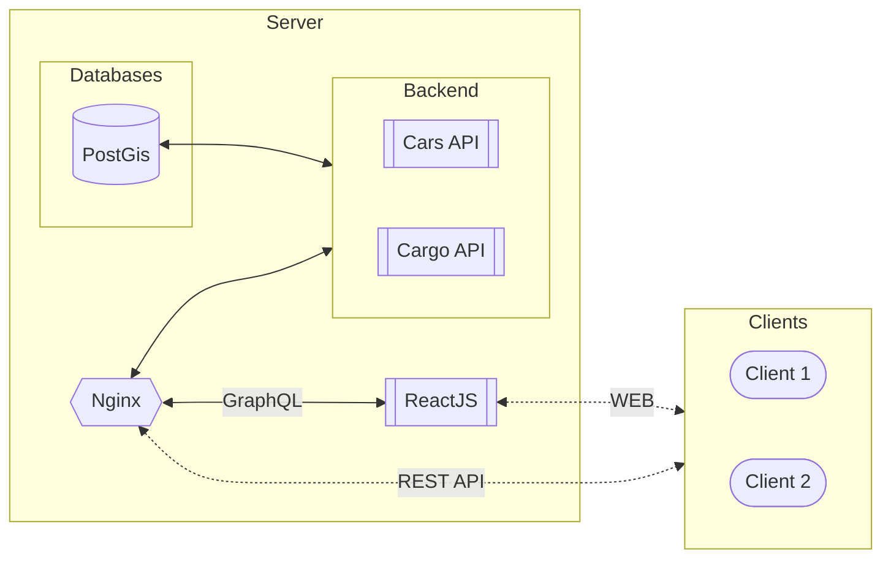

# delivery-service
>Сервис поиска ближайших машин для перевозки грузов.


---
### Установка
В корневой директории  выполните команду:
```sh
docker compose up -d --built
```

### Просмотр
Перейдите по адресу `0.0.0.0:8083` для просмотра карты с грузами и машинами или `0.0.0.0:8001` для работы с API сервиса.

### Архитектура

Сервис разделен на три части:
- База данных PostGis
- Backend на FastAPI
- Frontend на ReactJS

### License
Copyright © 2023 [dsuhoi](https://github.com/dsuhoi).

This project is [MIT](https://github.com/dsuhoi/delivery-service/blob/main/LICENSE) licensed.
